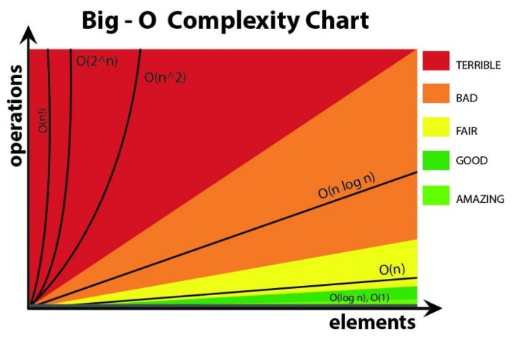

# COMS 3213 - Advance Data Structures and Algorithm Design

## Big-O Notation

Big-O notation is used to describe the complexities of an algorithm.
Used for describing the time complexities of an algorithm (an expression for
asymptopic upper bounds, only gives upper bounds).

<center>

</center>

Should only consider if n is large -> avoid designing complex algorithm.

Time complexity: time it takes an algorithm to compute an answer.


## Big-Omega Notation

Used to describe the lower bounds.

## P vs NP

The P stands for polynomial time. That is, given a problem, the solutions to
would be found in some polynomial time.

NP (nondeterministic-polynomial time) is given a set of possible solutions,

If a problem contains solutions X and it can be reduced to another problems
Y, it is considered NP-complete.

## Turing-complete

A machine that will find an answer via a program (with no guarentee to
runtime or memory). Programming languages such as C or Python are
Turing-complete. HTML is not turing complete, but HTML with JavaScript can be
turing complete.

## Inorder, Postorder, Preorder

For inorder, the ordering in which nodes are traversed are: left, root, right

```
              [11]
              /  \
             /    \
            /      \
           /        \
        [06]       [19]
        /  \       /  \
       /    \     /    \
     [04]  [08] [17]  [43]
       \      \       /  \
      [05]   [10]   [31][49]

```
| Traversal Type | Nodes           | Order                                    |
| -------------: | :-------------- | :--------------------------------------- |
|       inorder: | left→root→right | `4, 5, 6, 8, 10, 11, 17, 19, 31, 43, 49` |
|     postorder: | left→right→root | `5, 4, 10, 8, 6, 17, 31, 49, 43, 19, 11` |
|      preorder: | root→left→right | `11, 6, 4, 5, 8, 10, 19, 17, 43, 31, 49` |

### Inorder Code Ex:
```c++
void inOrder(Node* node) {
  if(node != nullptr) {
    // Traverse all the left and print
    inOrder(node->left);
    // Print root node
    printf("%d", node->item);
    // Traverse all the right and print
    inOrder(node->right);
  }
}
```
#### Post-order Code Ex:
```c++
void postOrder(Node* node) {
  if(node != nullptr) {
    // Traverse left and print
    postOrder(node->left);
    // Traverse right and print
    postOrder(node->right);
    // Print the root
    printf("%d", node->item);
  }
}
```
#### Pre-order Code Ex:
```c++
void preOrder(Node* node) {
  if(node != nullptr) {
    // Print root
    printf("%d", node->item);
    // Traverse left and print
    preOrder(node->left);
    // Traverse right and print
    preOrder(node->right);
  }
}
```

# Handshaking Lemma
This is a proof that says `in any graph, the sum of all vertex-degree is equal to twice the number of edges`.
